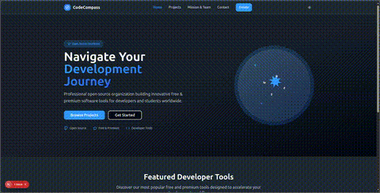

# CodeCompass Website
<p align="center">
  <a href="https://github.com/CodeCompasss/code_compass_website/actions">
    
  </a>
  <a href="LICENSE">
    
  </a>
  <a href="https://github.com/CodeCompasss/code_compass_website/issues">
    
  </a>
  <a href="https://github.com/CodeCompasss/code_compass_website/pulls">
    
  </a>
  <a href="https://github.com/CodeCompasss/code_compass_website/graphs/contributors">
    
  </a>
</p>

<!-- ---

<p align="center">
  
</p>

--- -->


**CodeCompass Website** is the official platform for CodeCompass, an open-source organization building innovative tools for developers and students. The site showcases our projects, team, mission, and provides resources for the community.

- 🌐 Built with Next.js, Tailwind CSS, and TypeScript
- 🎨 Modern, responsive, and accessible UI
- 🛠️ Project explorer for both developer and student tools
- 🌙 Dark mode support
- 🤝 Community-driven and open to contributions

---

## ✨ Features

- **Project Gallery:** Browse all CodeCompass tools, filter by developer/student focus
- **Team & Mission:** Meet the team and learn about our mission
- **Contact & Donate:** Get in touch or support our work
- **Dark/Light Mode:** Seamless theme switching
- **Mobile Ready:** Fully responsive design

---

## 📸 Demo

> 

---

## 🛠️ Tech Stack

- [Next.js](https://nextjs.org/)
- [TypeScript](https://www.typescriptlang.org/)
- [Tailwind CSS](https://tailwindcss.com/)
- [Framer Motion](https://www.framer.com/motion/)
- [Lucide Icons](https://lucide.dev/)
- [TanStack Query](https://tanstack.com/query/latest)

---

## 🚩 Getting Started

### 1. Clone the repository

```bash
git clone https://github.com/CodeCompasss/code_compass_website.git
cd code_compass_website
```

### 2. Install dependencies

```bash
npm install
```

### 3. Run the development server

```bash
npm run dev
```

Visit [http://localhost:3000](http://localhost:3000) to view the site.

---

## 📁 Project Structure

```
code_compass_website/
├── public/
│   ├── assets/
│   └── data/
├── src/
│   ├── app/
│   ├── components/
│   ├── hooks/
│   ├── lib/
│   └── types/
├── tailwind.config.ts
├── postcss.config.mjs
├── package.json
└── ...
```

---

## 🤝 Contributing

We welcome contributions! Please read our [CONTRIBUTING.md](CONTRIBUTING.md) for guidelines.

- Fork the repo
- Create a new branch (`git checkout -b feature/your-feature`)
- Commit your changes
- Open a pull request

---

## 📄 License

This project is licensed under the [Custom](LICENSE).

---

## 💬 Contact & Community

<!-- - [GitHub Discussions](https://github.com/CodeCompasss/code_compass_website/discussions) -->
<!-- - [Twitter](https://twitter.com/codecompass) -->
- [LinkedIn](https://linkedin.com/company/codecompass)

---

<div align="center">
  **Made with ❤️ by the CodeCompass Team**
</div>
